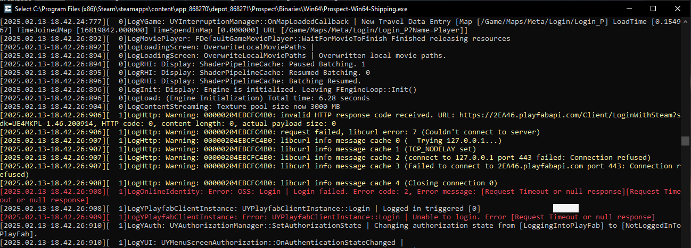
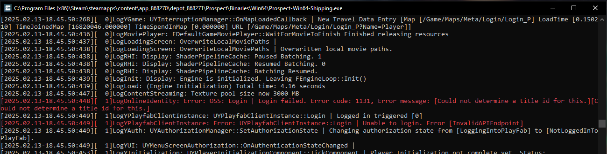
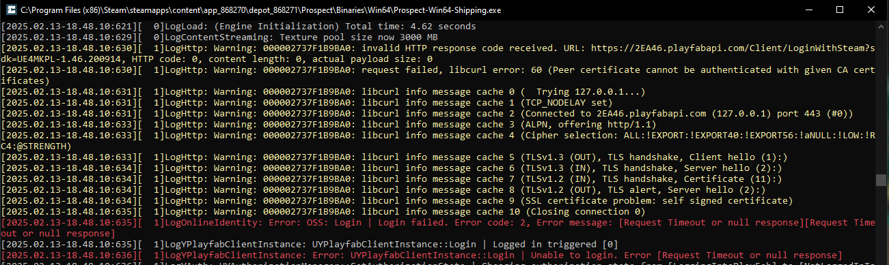
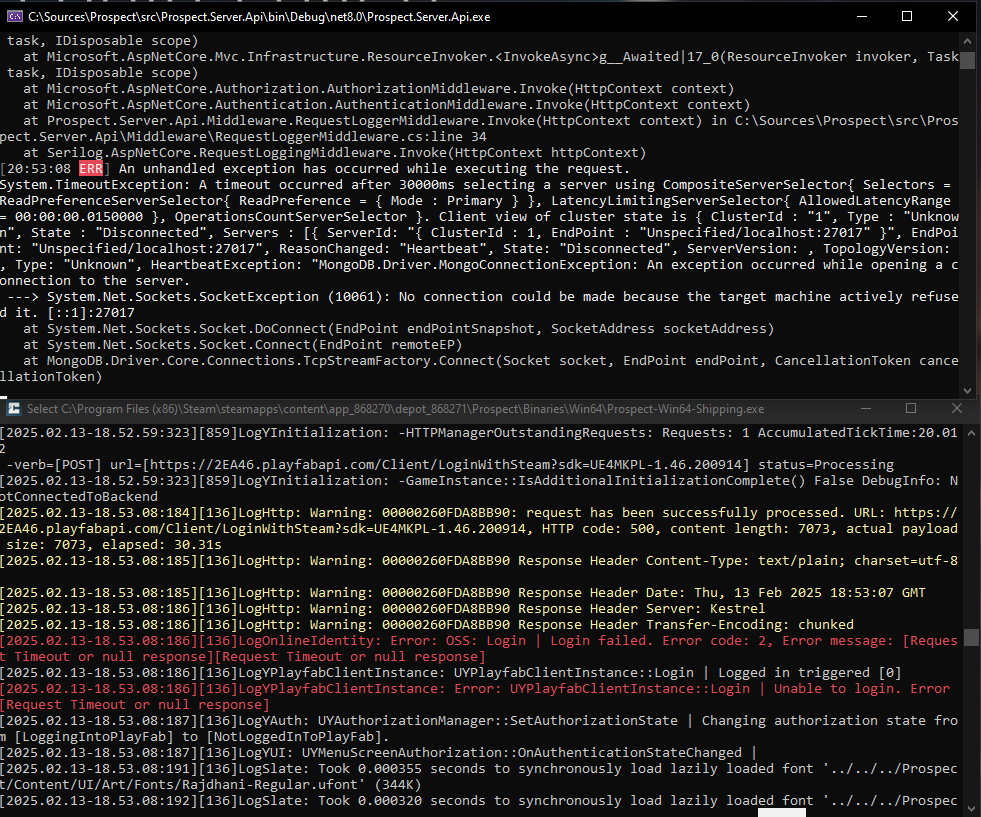

# Prospect <!-- omit in toc -->

Also known as "The Cycle: Frontier".

## Table of Contents <!-- omit in toc -->

- [Features](#features)
- [Running locally](#running-locally)
  - [1. Prerequisites](#1-prerequisites)
    - [1.1 How to download Season 2 client from SteamDB using Steam console](#11-how-to-download-season-2-client-from-steamdb-using-steam-console)
  - [2. Unpack `Prospect.Server.Api`](#2-unpack-prospectserverapi)
  - [3. Generate and import SSL certificate](#3-generate-and-import-ssl-certificate)
  - [4. Extract `LoaderPack` to the game](#4-extract-loaderpack-to-the-game)
  - [5. Run the server](#5-run-the-server)
  - [6. Run the game](#6-run-the-game)
- [Troubleshooting and FAQ](#troubleshooting-and-faq)
  - [How to remove the certificate?](#how-to-remove-the-certificate)
  - [`generate_ssl.exe` is flagged as a virus](#generate_sslexe-is-flagged-as-a-virus)
  - [Body parts are missing with Season 3 client](#body-parts-are-missing-with-season-3-client)
  - [Prospect.Server.Api does not start](#prospectserverapi-does-not-start)
  - [Login Failed. Error code: 3](#login-failed-error-code-3)
  - [Login Failed. Error code: 5](#login-failed-error-code-5)
- [Development](#development)

## Features

* [x] Basic login with Steam
* [x] EULA acceptance
* [x] Tutorial
* [x] Single-player station (Season 2 and Season 3):
  * [x] Onboarding
  * [ ] Matchmaking and deployment
    * [x] Solo
    * [ ] Squad
    * [ ] Items insurance
    * [ ] Free loadouts (Season 3)
  * [x] Inventory and loadout
    * [ ] Loadout presets (Season 3)
  * [x] Quests
  * [x] Faction progression
  * [ ] Season pass
  * [ ] Aurum Shops
    * [ ] Daily shop
    * [ ] Weekly shop
    * [ ] Shop rotation
  * [x] Daily login
  * [x] Character appearance and emotes
  * [x] Item Shops
  * [x] Crafting station
  * [x] Quarters
  * [x] Player balance
  * [ ] Social features
  * [ ] Proximity voice
    * [x] Vivox login
    * [x] Vivox create and join channel
    * [ ] Proximity voice works
* [ ] Game mechanics
  * [x] Can deploy through terminal
  * [x] Can deploy with loadout
  * [x] Can evac
  * [ ] Can do quests
    * [x] Delivery quests
    * [ ] Kill quests
  * [x] Can gain/lose loot
  * [x] Can use Alien Forge.
* [x] Map content
  * [x] Bright Sands
  * [x] Crescent Falls
  * [x] Tharis Island

## Running locally

> [!NOTE]
> If you've already done all steps previously, you can skip to Step 7.

### 1. Prerequisites

> [!WARNING]
> The latest Steam version of The Cycle: Frontier currently does not work with Windows 11 24H2!

> [!IMPORTANT]
> You must have The Cycle: Frontier from Steam in your Steam library to be able to download it.
> Otherwise, the download will fail with an error message about missing license.

Before you start, you'll need the following software downloaded and installed:

1. [MongoDB Community Edition](https://fastdl.mongodb.org/windows/mongodb-windows-x86_64-8.0.4-signed.msi).

1. [`Prospect.Server.Api` and `LoaderPack`](https://github.com/deiteris/Prospect/releases) from the Releases section:

   - For Season 3 (the latest Steam game client), use Build 6.

   - For Season 2 game client, use the latest version.

1. The Cycle: Frontier game client:

   - The latest version from [Steam](https://steamcommunity.com/app/868270).

   - Season 2 client version `4623363103423775682` from SteamDB. See [download instructions below](#11-how-to-download-season-2-client-from-steamdb-using-steam-console).

#### 1.1 How to download Season 2 client from SteamDB using Steam console

> [!WARNING]
> This will overwrite the existing client if you try to download a different manifest!

1. With Steam running, press `Win+R` and enter `steam://nav/console`. A Steam console will open.

1. Open [The Cycle: Frontier SteamDB manifests](https://steamdb.info/depot/868271/manifests/).

1. Make sure you have **Copy format** set to **Steam console**.

1. Press `CTRL+F` and enter `4623363103423775682` to find the manifest for Season 2 version 2.7.2 client.

1. Click the  icon to copy the download command.

1. Paste the command in the Steam console and press `Enter`.

1. The depot will begin downloading. You should receive a notification and the destination folder when the download is complete.

### 2. Unpack `Prospect.Server.Api`

Use your favorite ZIP archiver and unzip the `Prospect.Server.Api.zip` downloaded from this repository.

### 3. Generate and import SSL certificate

> [!IMPORTANT]
> Do not share the generated certificate! Generated certificate includes a private key that may be used to generate other certificates and compromise your security.

A connection to the server is served over a secured connection. The server uses self-signed certificate that must be added to trusted authorities in order for the game
to successfully communicate with the local server. Do the following:

1. Open the folder with `Prospect.Server.Api`.

1. Double-click `generate_ssl.exe`. `certificate.pfx` will appear in the same folder.

1. Double-click `certificate.pfx`. The Certificate Import Wizard will open:

    1. Select **Current User** under Store Location and click **Next**.

    1. Leave **File to Import** unchanged and click **Next**.

    1. Leave **Password** empty and click **Next**.

    1. Select **Place all certificates in the following store** > **Browse...**. Choose **Trusted Root Certification Authorities** and click **OK**. Click **Next**.

    1. Click **Finish**. A **Security Warning** popup may appear, make sure it specifies `2EA46.playfabapi.com` certification authority and click **Yes**.

### 4. Extract `LoaderPack` to the game

1. Open the folder with The Cycle: Frontier and navigate to **Prospect** > **Binaries** > **Win64**.

1. Open the `LoaderPack` archive.

1. Drag and drop the contents of the `LoaderPack` archive to the game.

1. Create a shortcut for the `Prospect.Client.Loader` that you will use later to launch the game.

### 5. Run the server

Now you are all set! Open the folder with `Prospect.Server.Api` and run `Prospect.Server.Api.exe`. It will open a console if it runs successfully.

> [!IMPORTANT]
> Do not close the console when you run the game.

### 6. Run the game

Once the server is running, make sure that Steam is running and open The Cycle: Frontier using the shortcut you've created before.

## Troubleshooting and FAQ

### How to remove the certificate?

If you've installed the certificate for the **Current User**:

1. Open **Start** and enter `certmgr.msc`.

1. Expand **Trusted Root Certification Authorities** and select **Certificates**.

1. Find `2EA46.playfabapi.com`, right-click it > **Delete**.

If you've installed the certificate for the **Local Machine**, repeat the same steps but instead open `certlm.msc`.

### `generate_ssl.exe` is flagged as a virus

`generate_ssl.exe` is a Python application packed with PyInstaller and some anti-viruses may flag it as a virus.
This application is a simple certificate generator and you can find its source code in `utils/generate_ssl.py`.

### Body parts are missing with Season 3 client

Currently, the server loads body part IDs for Season 2 by default, so this is expected. You can fix this by going to station and changing your character appearance. This will store the updated body part IDs for your character.

### Prospect.Server.Api does not start

Make sure you have [.NET Runtime 8.0](https://aka.ms/dotnet-core-applaunch?missing_runtime=true&arch=x64&rid=win-x64&os=win10&apphost_version=8.0.11) and [ASP.NET Core 8.0](https://aka.ms/dotnet-core-applaunch?framework=Microsoft.AspNetCore.App&framework_version=8.0.0&arch=x64&rid=win-x64&os=win10) installed.

### Login Failed. Error code: 3

Make sure that:

* You have Steam running.
* You have created and **saved** the `steam_appid` file as described in step 6.
* The `steam_appid` file type is "TXT File".

### Login Failed. Error code: 5

Make sure that `Prospect.Server.Api` server is running.

If the server is running, press `Alt+Tab` to a game console that opens when you start the game and check for the following:

* `libcurl error 7 (Couldn't connect to server)` - indicates that the `Prospect.Server.Api` is not running.
  

* `InvalidAPIEndpoint` - indicates that you are running the game using the original shortcut and not using `Prospect.Client.Loader`.
  

* `libcurl error 60 (Peer certificate cannot be authenticated with given CA certificates)` - indicates that the certificate was not installed correctly. Make sure that the certificate is present in `certmgr.msc` and there is only one certificate. Try removing the certificate and importing it again by following step 4.
  

* `HTTP code: 500` - usually indicates that MongoDB is not running. Make sure that MongoDB is installed and and that `MongoDB Server` is running in `services.msc`.
  

## Development

TBD
